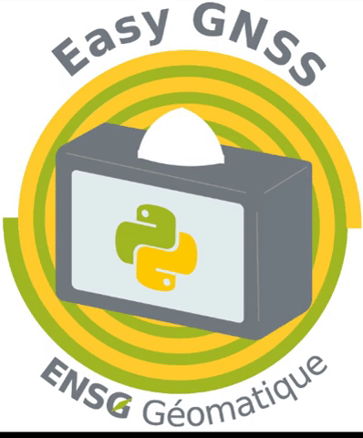

# Easy GNSS

## Introduction
Easy GNSS is a Graphical User Interface (GUI) for low-cost GNSS using Raspberry Pi. 
It provides different types of GNSS processing using the Open Source library RTKLIB.
It is based on [RTKBase](https://github.com/Francklin2/RTKLIB_Touchscreen_GUI) and on [TouchRTKStation](https://github.com/taroz/TouchRTKStation).

## How to assemble Easy GNSS
### Parts

- **Case:**  Create using 3D printer (STL data is [here](https://github.com/NChebbah/EasyGNSS/tree/master/3D)) or buy from [Shapeways](https://www.shapeways.com/shops/tarosuzuki)
- **GNSS receiver:** u-blox M8T [CSG shop](http://www.csgshop.com/product.php?id_product=205)
- **Mini-USB cable**
- **GNSS antenna:** Tallysman TW3710 or TW3740 (GPS+GLO+BDS L1) [Digi-Key(TW3710)](https://www.digikey.com/products/en?keywords=tw3710) or  [Digi-Key(TW3740)](https://www.digikey.com/products/en?keywords=tw3740)  
- **Raspberry Pi:** [https://www.raspberrypi.org/products/](https://www.raspberrypi.org/products/)
- **Micro SD card**
- **TNC(P)-SMA(J) connector**
- **SMA(P)-SMA(P) cable**
- **4inch Display:** Waveshare 4inch RPi LCD [Waveshare](https://www.waveshare.com/4inch-rpi-lcd-a.htm)
- **DC-DC converter:** 7.4V to 5V [Strawberry Linux](https://strawberry-linux.com/catalog/items?code=18697), [Amazon](https://www.amazon.com/DZS-Elec-Converter-Regulator-Charging/dp/B07121W7Q4/ref=sr_1_5?ie=UTF8&qid=1533692135&sr=8-5&keywords=dc%2Bconverter%2B5v%2Busb&dpID=51rETi5CNdL&preST=_SY300_QL70_&dpSrc=srch&th=1)
- **Micro-USB cable**
- **Battery holder:** Lilliput Battery Plate for Sony Battery F-970 [eBay](https://www.ebay.com/itm/LILLIPUT-Battery-Adapter-Base-Plate-F970-for-Sony-VX2100E-HVR-V1C-F330-/371421670220), [Amazon](https://www.amazon.com/Battery-Adapter-VX2100E-Lilliput-Accessory/dp/B009SJIG0K)
- **Battery:** Sony NP-F550/F570 (2900mAh) or NP-F750/F770 (5000mAh) [Amazon](https://www.amazon.com/dp/B07DC5RYPM/ref=cm_sw_em_r_mt_dp_U_qOHnCbFWY47XD)
- **Ground plane**

## Steps
1. Modify the battery holder
   Open and directly connect to the DC-DC converter

 

 

2. Mount the battery holder to the main case 

 

  

3. Mount the Raspberry Pi on the main case

  

4. Mount the Tallysman GNSS antenna to the top plate  
 
  

5. Connect the GNSS antenna cable to the GNSS receiver

6. Connect the USB cables

  

7. Mount the touch screen and put the top plate to the main case  

  

## How to install Easy GNSS
### Install Raspbian on the Raspberry Pi
  See [here](https://www.raspberrypi.org/documentation/installation/installing-images/)

### Install Easy GNSS
1. Connect the Raspberry Pi to the internet
2. Open a terminal
3. Download Easy GNSS  
    `$ git clone https://github.com/NChebbah/EasyGNSS`
4. Run install.sh  
    `$ cd EasyGNSS/install`  
    `$ sudo sh install.sh`
5. If you want to automatically start Easy GNSS, run autostart.sh  
    `$ cd /home/pi/EasyGNSS/install`  
    `$ sudo sh autostart.sh`

### How to run Easy GNSS  
    `$ sudo python3 /home/pi/EasyGNSS/app/src/main.py`

## How to use Easy GNSS
  See the User Guide [here](doc/UserGuide.pdf)

